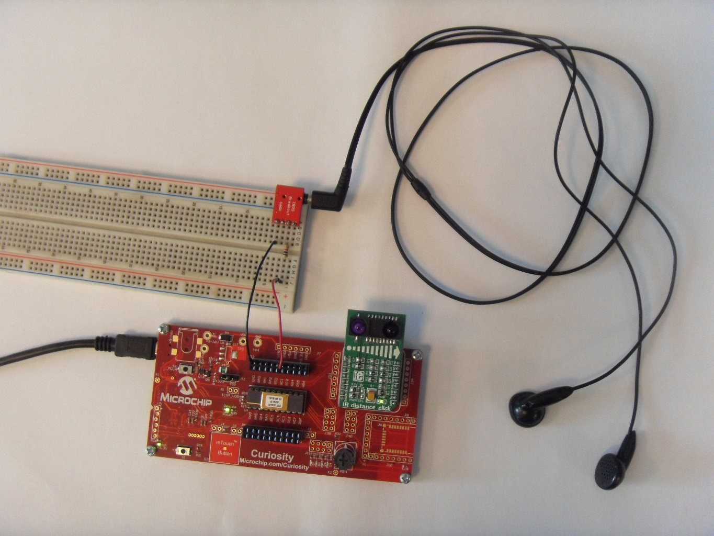
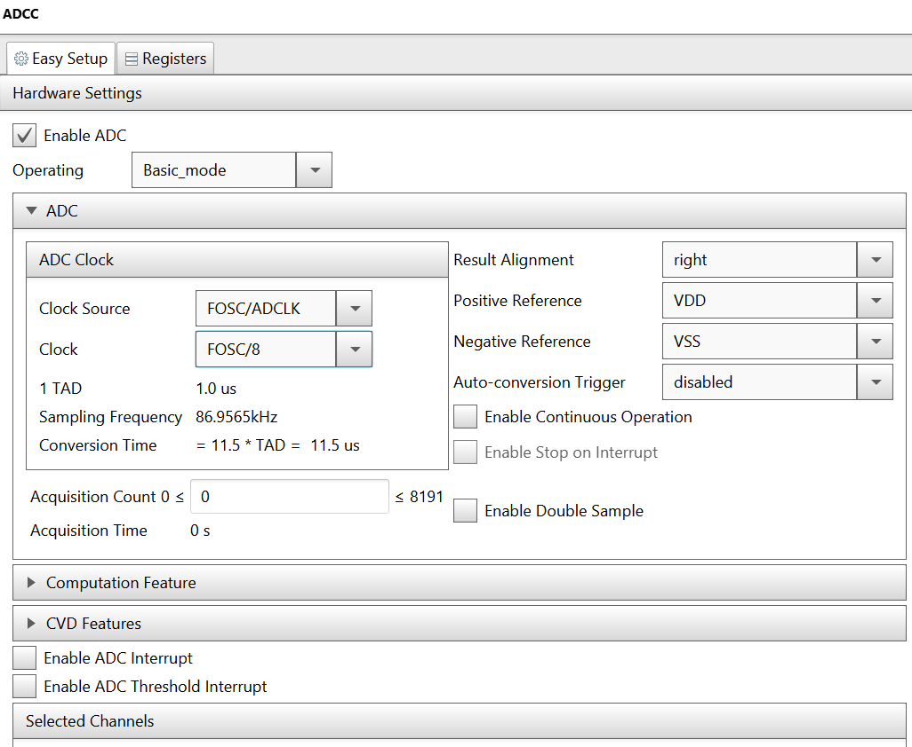
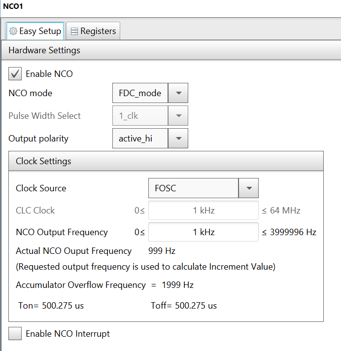
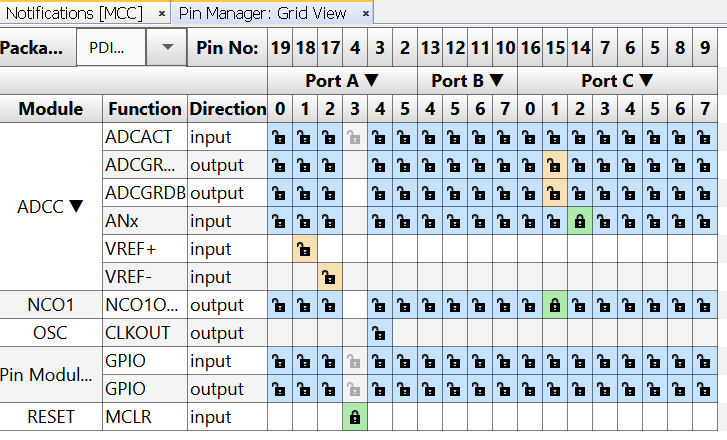

# IR Distance Value to Sound Using NCO

In this project the ADCC of the PIC16F18446 is used to read the IR Distance Sensor. The NCO is used to generate a tone with variable pitch according to the distance reading.

 

## Software Used
- MPLAB® X IDE 5.30 or newer [(microchip.com/mplab/mplab-x-ide)](http://www.microchip.com/mplab/mplab-x-ide)
- MPLAB® XC8 2.10 or newer compiler [(microchip.com/mplab/compilers)](http://www.microchip.com/mplab/compilers)
- MPLAB® Code Configurator (MCC) 3.95 or newer [(microchip.com/mplab/mplab-code-configurator)](https://www.microchip.com/mplab/mplab-code-configurator)
- MPLAB® Code Configurator (MCC) PIC10/PIC12/PIC16/PIC18 library v1.80 or newer [(microchip.com/mplab/mplab-code-configurator)](https://www.microchip.com/mplab/mplab-code-configurator)

## Hardware Used
- PIC16F18446 PDIP20 with Curiosity Development Board [(DM164137)](https://www.microchip.com/Developmenttools/ProductDetails/DM164137)
- IR distance click board™ [(MIKROE-1991)](https://www.mikroe.com/ir-distance-click)
- Generic earphones
- 3.5mm female jack break-out board
- 1kOhm resistor

## Setup

In this demo,

- PIC16F18446 (20-pin, PDIP) MCU is used to read the IR Distance Click and generate an adjustable frequency square signal.
- The Curiosity development board is used as it supports a mikroBUS slot for MikroElektronika™ click boards and has got on-board programmer and debugger.
- The IR Distance Click board from MikroElektronika™ is used for sensing the distance.
- A set of headphones in used to hear the output sound. The IR Distance sensor is read using the PIC's ADCC. In order to hear the sound, the headphone set must be connected in series with 1k resistor to RC1 and GND.

### MCC Settings

This section shows the settings used in the demo/example for various MCU modules configuration. These settings were done using the Microchip Code Configurator (MCC). Open MCC to look at the settings of the modules.

### System Module Settings

The MCU uses the high frequency internal oscillator (HFINTOSC), and the clock is set to 8 MHz. Watchdog Timer is not used in this demo, so it is disabled.

 

### ADCC Settings

ADCC is used to read the IR Distance sensor. It is configured to operate in basic mode, with a clock of Fosc/8.

 

### NCO1 Settings

NCO1 is used to generate the square signal on a specific frequency. It is configured to operate in fixed duty cycle (FDC) mode, with output active high, and clock source Fosc.

 

### Pin Manager Settings

The pins are configured as follows:

- ADCC input on RC2, named channel_ANC2
- NCO1 output is connected to pin RC1

 
 

# Demo

1. After making the above hardware connections, connect the headphones in series with 1k resistor to RC1 and GND.
2. Connect the Curiosity board to PC using the USB cable.
3. Build demo firmware and load the generated hex file onto the PIC16F18446 MCU. When the demo firmware is loaded, a tone will be heard in the headphones.
4. Move your hand above the IR Distance sensor to hear the tone frequency changing.

# Conclusion

This example shows how easy it is to use the PIC16F18446 and MCC to read the IR Distance Click and generate a variable frequency tone.
